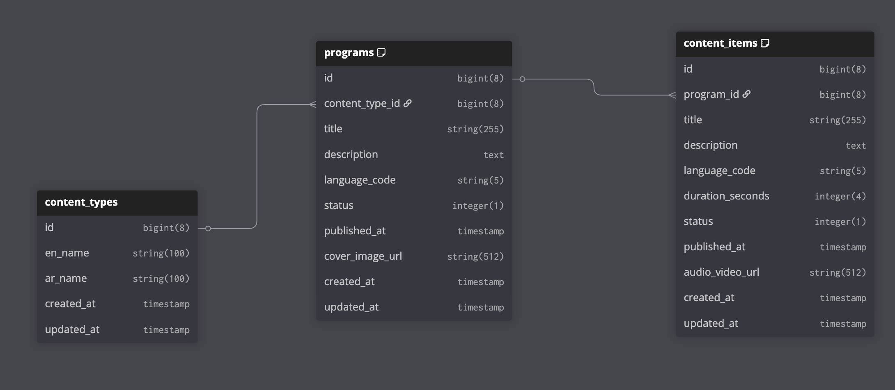

# README
# Overview

## Goal
Build a system to store and discover media programs (podcasts, documentary films/series).

## Components

### CMS (Admin)
- Create & edit Programs, Content Items, and Content Types.
- Supports immediate and scheduled publishing.

### Discovery (Public)
- Search & list **published-only** content with filtering by language/type/program.

## Tech Stack
- **Backend:** Ruby on Rails
- **Database:** PostgreSQL

---

# Data Model



## Key Fields

**ContentType**  
- `en_name`  
- `ar_name`

**Program**  
- `content_type_id`  
- `title`  
- `description`  
- `language_code`  
- `status` {draft, scheduled, published, archived}  
- `published_at`  
- `cover_image_url`

**ContentItem**  
- `program_id`  
- `title`  
- `description`  
- `language_code`  
- `duration_seconds`  
- `status` {draft, scheduled, published, archived}  
- `published_at`  
- `audio_video_url`

---

# API

## Admin (CMS)
### Content Types
```http
GET    /admin/content_types
GET    /admin/content_types/:id
```
## Programs

```http
GET    /admin/programs
POST   /admin/programs
GET    /admin/programs/:id
PATCH  /admin/programs/:id
DELETE /admin/programs/:id
POST   /admin/programs/:id/publish   # publish now or schedule
```

## Content Items
```http
GET    /admin/content_items?program_id=...&lang=...&page=1&per_page=50
POST   /admin/content_items
GET    /admin/content_items/:id
PATCH  /admin/content_items/:id
DELETE /admin/content_items/:id
POST   /admin/content_items/:id/publish
```

---

## Pagination
```text
?page=1&per_page=50   # max 100
```

---

## Discovery (Public)
```http
GET /programs?lang=ar&content_type=podcast&page=1&per_page=20
GET /programs/:id
GET /content_items?program_id=5&lang=ar&page=1&per_page=20
GET /content_items/:id
```

---

## Prerequisites

1) **Clone the repo**
```bash
git clone https://github.com/abeeralamri/CMS-Discovery-Assignment.git
cd CMS-Discovery-Assignment
```

2) **Build & start**
```bash
docker compose up -d --build
```

3) **Prepare the database**  
Fresh setup (create + migrate + seed):
```bash
docker compose exec web bin/rails db:create db:migrate db:seed
```

---

## Quick Smoke Tests

### Public (Discovery)
```bash
curl -s http://localhost:3000/programs | jq
curl -s "http://localhost:3000/content_items?program_id=1&lang=ar&page=1&per_page=20" | jq
```

### Admin (CMS)

**Create a program**
```bash
curl -s -X POST http://localhost:3000/admin/programs \
  -H "Content-Type: application/json" \
  -d '{
        "program": {
          "content_type_id": 1,
          "title": "Thmanyah Podcast",
          "description": "A talk show",
          "language_code": "ar",
          "status": "draft"
        }
      }' | jq
```

**Publish now**
```bash
curl -s -X POST http://localhost:3000/admin/programs/1/publish | jq
```

**Schedule publish**
```bash
curl -s -X POST http://localhost:3000/admin/programs/1/publish \
  -H "Content-Type: application/json" \
  -d '{ "published_at": "2025-08-20T18:00:00Z" }' | jq
```

**Create a content item**
```bash
curl -s -X POST http://localhost:3000/admin/content_items \
  -H "Content-Type: application/json" \
  -d '{
        "content_item": {
          "program_id": 1,
          "title": "Episode 1",
          "description": "Intro episode",
          "language_code": "ar",
          "duration_seconds": 1800,
          "status": "draft",
          "audio_video_url": "https://cdn.example.com/ep1.mp4"
        }
      }' | jq
```

**Publish content item**
```bash
curl -s -X POST http://localhost:3000/admin/content_items/1/publish | jq
```
